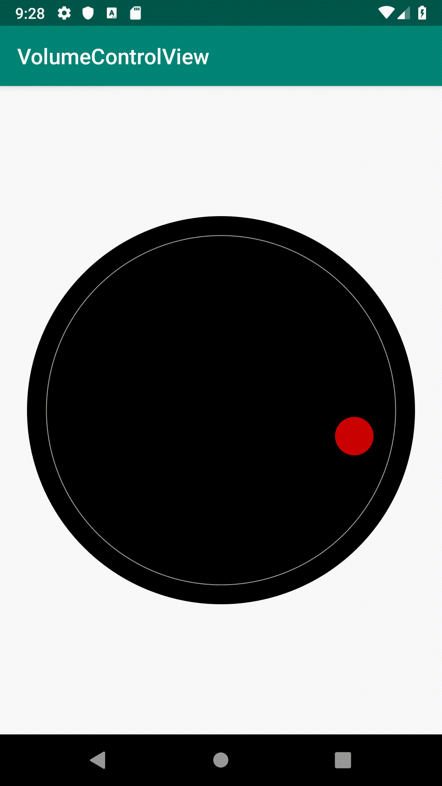

# Android_Custom_View_Volume

## Introduction

For this app, you'll design a custom volume control knob view. The resulting view must use custom attributes allow it to be customized, must allow setting and retrieval of the current volume setting and the volume must be set with a swipe event and update fluidly.



## Steps

1. Custom view with custom artwork, you are welcome to use a bitmap image or draw it on the canvas. I preferred to build a custom image by drawing circles on the canvas.
> You can use `getWidth()` and `getHeight()` divided by 2 to get the center point of the canvas, and then use the smaller of those two to get the raduis of a circle to fill that space
> I use percentages of those values to draw the rest of the knob in order to allow it to scale with the size of the canvas. This takes a good amount of tinkering to get it just right
> Create a data member which represents canvas rotation. Use canvas.rotate() to rotate the canvas

2. Override `onTouchEvent` to handle interaction with your view. Your view should now rotate on swipe.
> The following code skeleton shows how this can be done:
> ```Kotlin
> override fun onTouchEvent(event: MotionEvent): Boolean { // triggered each time the touch state changes 
>    when (event.action) {
>        MotionEvent.ACTION_DOWN // triggered when view is touched
>        -> {
>        }
>        MotionEvent.ACTION_MOVE // triggered after ACTION_DOWN but when touch is moved
>        ->
>            // get end point and calculate total distance traveled
>            // use the total distance traveled to calculate the desired change in rotation
>            // apply that change to your rotation variable
>            // you may want to use a minimum and maximum rotation value to limit the rotation
>            // use the new rotation to convert to the desired volume setting
>            invalidate() // this will cause the onDraw method to be called again with your new values
>        MotionEvent.ACTION_UP // triggered when touch ends
>        -> {
>        }
>    }// get and store start point with event.getX()
>    return true // this indicates that the event has been processed
>}
> ```

3. Write a getter and setter for the current volume setting
4. Add attributes to attrs.xml
> Be sure to chose the correct type for the data, these types are the same as the available types of resource files, color, integer, etc. Anything that doesn't appear in the suggestions, would be a reference
 
5. Retreive the attributes from the `TypedArray` in your `init` method and provide default values which match what you are currently using, replace current values with these variables.
> Be sure to call `recycle()` on your `TypedArray` in `init` to close it up when you are done

6. Add references to those attributes in your layout file and play with their values to see how it affects your view

#### Go Further

* Add getters and setters for all your attributes to allow for your view to be created programatically in the activity class
* Experiment with Canvas to improve the look of your view
